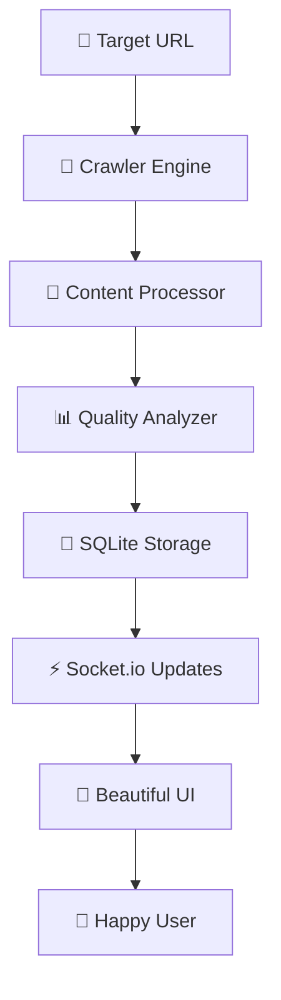

# 🌸 Miku Miku Crawler 🌸

<div align="center">
  

  <h3>✨ The Most Kawaii Web Crawler in the Universe! ✨</h3>

  
  
  
  
</div>

---

## 🎭 What is Miku Miku Crawler?

A **supercharged real-time web crawler** with **dazzling visualizations** and **Miku-powered animations**! This isn't just another boring crawler - it's a **magical experience** that makes web scraping fun, interactive, and absolutely kawaii!

🚀 **Real-time crawling** with Socket.io magic
🎨 **Beautiful UI** with Miku-themed animations
📊 **Advanced content processing** with AI-powered analysis
💾 **Smart data storage** with SQLite persistence
🌈 **Interactive visualizations** that bring data to life

Inspired by [MikuMikuBeam](https://github.com/sammwyy/MikuMikuBeam) by [Sammwy](https://github.com/sammwyy), but **supercharged** with enterprise-grade features and **kawaii magic**!


---

## ✨ Features That Will Blow Your Mind

### 🚄 **Lightning-Fast Crawling Engine**

🔥 **Advanced Real-Time Crawling** - Socket.io powers instant updates with zero lag!
🧠 **Smart Content Processing** - AI-powered analysis extracts structured data, keywords, and quality metrics
⚡ **Dynamic Content Support** - Handles JavaScript-heavy sites with Puppeteer magic
🔗 **Intelligent Link Discovery** - Automatically finds and follows internal links
🤖 **Robots.txt Compliance** - Respects website rules like a good web citizen
🚀 **Concurrent Processing** - Multiple pages processed simultaneously for ultra-speed
🔄 **Smart Retry System** - Exponential backoff ensures reliable crawling

### 📊 **Epic Data Analysis & Processing**

📈 **Content Quality Scoring** - 0-100 quality assessment based on multiple factors
🔍 **Keyword Extraction** - Automatically identifies and counts important keywords
🌍 **Language Detection** - Identifies content language with confidence scoring
📖 **Reading Time Calculation** - Estimates reading time for content pieces
🖼️ **Media Analysis** - Processes images, videos, and other media files
📋 **Structured Data Extraction** - Pulls JSON-LD, Open Graph, and microdata
🔗 **Link Classification** - Categorizes internal, external, social, and navigation links

### 🎨 **Stunning Visual Experience**

🌈 **Live Statistical Dashboard** - Real-time metrics with beautiful charts and counters
🔍 **Interactive Page Explorer** - Rich content preview with processed data display
🎯 **Advanced Search & Filter** - Find crawled pages instantly with smart filtering
📤 **Export Functionality** - Save data as JSON or CSV with one click
🍞 **Toast Notifications** - Stylish pop-up feedback for all actions
📱 **Responsive Design** - Perfect on desktop, tablet, and mobile

### 🎮 **Miku Magic & Animations**

✨ **Dazzling Miku Effects** - Flashy animations that respond to crawl activity
🎵 **Reactive Audio Experience** - Synchronized sound effects with volume control
🌟 **Dynamic Theme Transitions** - UI transforms as Miku powers up the crawler
💫 **Particle Animations** - Sparkling visual feedback for every action
🎭 **Interactive Miku Character** - Animated mascot that reacts to crawler status

### 🔧 **Enterprise-Grade Configuration**

⚙️ **Advanced Settings Panel** - Fine-tune every aspect of crawling behavior
💾 **Persistent SQLite Storage** - All data safely stored with automatic migrations
🏷️ **Domain-Specific Controls** - Different settings for different websites
🛡️ **Content Sanitization** - XSS protection for safe content display
📊 **Performance Monitoring** - Real-time memory and performance metrics

---

## 🚀 Quick Start Guide

### 📦 **Installation**

```bash
# Clone the magical repository
git clone https://github.com/renbkna/mikumikucrawler
cd mikumikucrawler

# Install all the dependencies
npm install

# Launch the Miku magic! ✨
npm run dev
```

### 🌟 **First Crawl**

1. **Open** `http://localhost:5174` in your browser
2. **Enter** a target URL (e.g., `https://example.com`)
3. **Customize** your crawl settings
4. **Click** "Start Miku Beam" and watch the magic happen! 🎭

### 🔧 **Environment Setup**

Copy `.env.example` to `.env` and customize:

```env
# Frontend Configuration
VITE_BACKEND_URL=http://localhost:3000

# Backend Configuration
PORT=3000
FRONTEND_URL=http://localhost:5174
LOG_LEVEL=info
```

---

## 🎮 Crawler Configuration

### ⚙️ **Basic Settings**

| Setting | Description | Default | Range |
|---------|-------------|---------|-------|
| **Target URL** | Website to crawl | - | Any valid URL |
| **Crawl Depth** | How deep to go | `2` | 1-5 levels |
| **Max Pages** | Maximum pages to scan | `50` | 1-200 pages |
| **Crawl Delay** | Delay between requests | `1000ms` | 500-5000ms |
| **Method** | Crawl strategy | `links` | links/content/media/full |

### 🔥 **Advanced Options**

| Setting | Description | Default | Impact |
|---------|-------------|---------|--------|
| **Concurrent Requests** | Parallel processing | `5` | Speed vs Server Load |
| **Retry Limit** | Failed request retries | `3` | Reliability vs Time |
| **Dynamic Content** | JavaScript rendering | `true` | Modern sites support |
| **Respect Robots** | Follow robots.txt | `true` | Ethical crawling |
| **Content Only** | Metadata only mode | `false` | Memory optimization |
| **Process Media** | Analyze media files | `false` | Rich data extraction |

---

## 🎨 **UI Features Showcase**

### 🌈 **Real-Time Dashboard**

- **Live counters** showing pages crawled, data size, and speed
- **Progress bars** with smooth animations and color transitions
- **Domain statistics** with beautiful pie charts and metrics
- **Quality distribution** showing content quality across crawled pages

### 🔍 **Enhanced Page Display**

- **Processed Data View** - Rich metadata with quality scores, keywords, and analysis
- **Raw Content View** - Original HTML with safe iframe rendering
- **Media Gallery** - Visual display of extracted images and media
- **Quality Issues** - Actionable insights for content improvement

### 📊 **Advanced Analytics**

- **Content Analytics** - Word count, reading time, language detection
- **Link Analysis** - Internal vs external link ratios and classifications
- **Media Metrics** - Image count, video detection, file type analysis
- **Quality Scoring** - Comprehensive 0-100 quality assessment

---

## 🔌 **API Reference**

### **Health Check**

```http
GET /health
```

```json
{
  "status": "ok",
  "activeCrawls": 1,
  "uptime": 3600,
  "memoryUsage": {
    "used": 45.2,
    "total": 512
  }
}
```

### **Statistics**

```http
GET /api/stats
```

```json
{
  "status": "ok",
  "stats": {
    "totalPages": 150,
    "totalDataSize": 2500000,
    "uniqueDomains": 3,
    "averageQuality": 78.5,
    "languageDistribution": {
      "en": 120,
      "es": 20,
      "fr": 10
    },
    "lastCrawled": "2023-10-15T14:30:00Z"
  }
}
```

### **Socket.io Events**

```javascript
// Start crawling
socket.emit('startAttack', { target, options });

// Real-time updates
socket.on('crawlUpdate', (data) => {
  // Live crawl progress with processed content
});

// Export data
socket.emit('exportData', { format: 'json' });
```

---

## 🏗️ **Architecture & Tech Stack**

### 🎭 **Frontend Magic**

- **React 18** - Modern UI with hooks and concurrent features
- **TypeScript** - Type-safe development for reliability
- **Tailwind CSS** - Utility-first styling with custom animations
- **Vite** - Lightning-fast development and building
- **Socket.io Client** - Real-time bidirectional communication
- **Lucide React** - Beautiful, consistent iconography

### 🏗️ **Backend Power**

- **Node.js** - High-performance JavaScript runtime
- **Express** - Minimal, fast web framework
- **Socket.io** - Real-time WebSocket communication
- **Puppeteer** - Headless Chrome for dynamic content
- **Cheerio** - Fast, jQuery-like server-side HTML parsing
- **SQLite** - Lightweight, embedded database
- **Winston** - Professional logging with multiple transports

### 🧠 **Content Processing Engine**

- **Natural Language Processing** - Keyword extraction and analysis
- **Quality Assessment** - Multi-factor content scoring algorithm
- **Structured Data Extraction** - JSON-LD, Open Graph, microdata parsing
- **Media Analysis** - Image, video, and document processing
- **Link Classification** - Intelligent categorization of discovered links

---

## 🚢 **Deployment Options**

### 🌐 **Production Deployment**

```bash
# Build for production
npm run build

# Start production server
npm start
```

### ☁️ **Cloud Platforms**

#### **Railway** 🚂

1. Connect your GitHub repository
2. Set environment variables:

   ```
   PORT=3000
   FRONTEND_URL=https://your-domain.com
   ```

3. Deploy automatically!

#### **Vercel** (Frontend) ⚡

1. Import repository to Vercel
2. Set build command: `npm run build`
3. Set environment: `VITE_BACKEND_URL=https://your-api.com`

#### **Heroku** 🟣

1. Create new Heroku app
2. Add buildpack: `heroku/nodejs`
3. Configure environment variables
4. Deploy with Git push

---

## 🔮 **How The Magic Works**


```mermaid
graph TD
    A[🎯 Target URL] --> B[🤖 Crawler Engine]
    B --> C[🧠 Content Processor]
    C --> D[📊 Quality Analyzer]
    D --> E[💾 SQLite Storage]
    E --> F[⚡ Socket.io Updates]
    F --> G[🎨 Beautiful UI]
    G --> H[👤 Happy User]
```

1. **🎯 URL Input** - User enters target URL with custom settings
2. **🤖 Smart Crawling** - Puppeteer + Cheerio extract content intelligently
3. **🧠 AI Processing** - Advanced algorithms analyze content quality and structure
4. **📊 Data Enrichment** - Keywords, language, media, and links are processed
5. **💾 Secure Storage** - Everything saved in SQLite with automatic migrations
6. **⚡ Real-time Updates** - Socket.io streams live progress to the frontend
7. **🎨 Beautiful Display** - Rich UI shows processed data with Miku magic!

---

## ⚠️ **Responsible Crawling Guidelines**

🙏 **This tool is for educational and legitimate purposes only!**

### 📋 **Best Practices**

- ✅ **Get permission** before crawling websites
- ✅ **Respect robots.txt** and crawl-delay directives
- ✅ **Use reasonable delays** to avoid overwhelming servers
- ✅ **Monitor your impact** and adjust settings accordingly
- ✅ **Be a good netizen** and crawl responsibly

### 🚫 **Don't Do This**

- ❌ Crawl without permission
- ❌ Ignore rate limits or robots.txt
- ❌ Overload servers with too many requests
- ❌ Scrape copyrighted content without authorization
- ❌ Use for malicious purposes

---

## 🌟 **Coming Soon**

- 📱 **Progressive Web App** - Install as mobile app
- 🌐 **Multi-language Support** - Interface in multiple languages
- 📊 **Advanced Analytics** - Charts, graphs, and trend analysis
- 🧠 **AI Content Insights** - Machine learning-powered analysis
- 🔄 **Scheduled Crawls** - Automated recurring crawls
- 🔌 **API Integrations** - Connect with external services
- 📈 **Performance Optimization** - Even faster crawling speeds
- 🎨 **Custom Themes** - Personalize your Miku experience

---

## 🤝 **Contributing**

We love contributions! Here's how you can help make Miku Miku Crawler even more amazing:

### 🐛 **Bug Reports**

Found a bug? Please open an issue with:

- Clear description of the problem
- Steps to reproduce
- Expected vs actual behavior
- Screenshots if applicable

### ✨ **Feature Requests**

Have an idea? We'd love to hear it! Open an issue with:

- Detailed description of the feature
- Use cases and benefits
- Any implementation ideas

### 💻 **Code Contributions**

1. Fork the repository
2. Create a feature branch: `git checkout -b amazing-feature`
3. Make your changes with tests
4. Commit: `git commit -m 'Add amazing feature'`
5. Push: `git push origin amazing-feature`
6. Open a Pull Request

---

## 👨‍💻 **Contributors**

<div align="center">

### 🌟 **Core Team**

**[renbkna](https://github.com/renbkna)** - Lead Developer & Miku Enthusiast

### 🙏 **Special Thanks**

**[Sammwy](https://github.com/sammwyy)** - Original MikuMikuBeam inspiration

</div>

---

## 📜 **License**

This project is **MIT licensed**. See [LICENSE](LICENSE) for details.

---

## 🌸 **Why Miku?**

Because web crawling doesn't have to be boring! **Miku Miku Crawler** proves that powerful technology can be wrapped in a package that's actually **fun to use**. Who says enterprise-grade web scraping can't be kawaii?

With Miku by your side, every crawl becomes an adventure, every data point a discovery, and every analysis a celebration! 💖

---

<div align="center">


### 🌸 **Miku Miku Crawler - Where Technology Meets Kawaii!** 🌸

**Made with 💖 by developers who believe coding should be cute!**

---

[](https://github.com/renbkna/mikumikucrawler/stargazers)
[](https://github.com/renbkna/mikumikucrawler/network/members)
[](https://github.com/renbkna/mikumikucrawler/issues)

</div>
