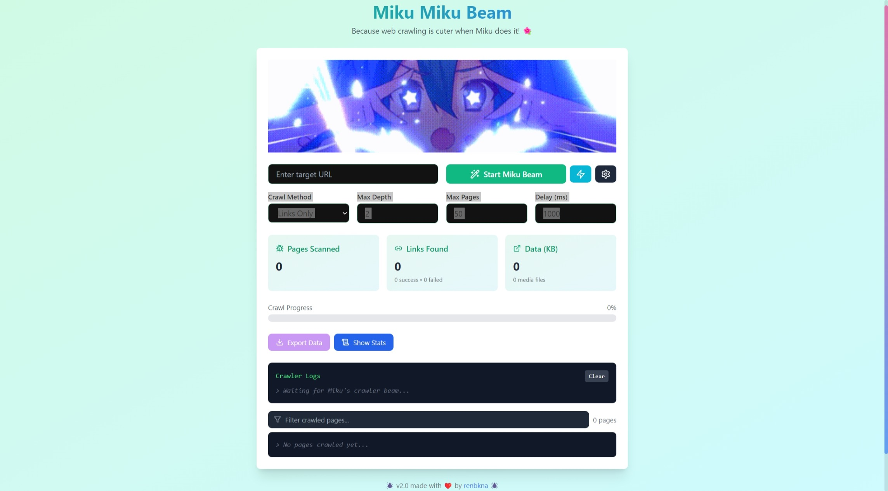

# 🌸 Miku Miku Crawler 🌸

<div align="center">
  
  
  
</div>

A **supercharged real-time web crawler** with **dazzling visualizations** and **Miku-powered animations**! This interactive crawler harnesses the power of **Puppeteer, Cheerio, and Socket.io** to explore websites at lightning speed while delivering a **kawaii user experience**!

Crawl websites, extract data, and watch the **magic happen in real-time** with colorful stats, interactive displays, and Miku-themed visual effects that make data collection fun!

Inspired by [MikuMikuBeam](https://github.com/sammwyy/MikuMikuBeam) by [Sammwy](https://github.com/sammwyy), but supercharged with advanced features and dazzling new effects!



## ✨ Features Galore

### 🚄 Core Crawling Power

✅ **Advanced Real-Time Crawling:** Socket.io powers instant updates with lightning-fast performance!  
✅ **Super Dynamic Content Support:** Handles even the most JavaScript-heavy sites with Puppeteer!  
✅ **Smart Link Extraction:** Intelligently identifies and follows internal links!  
✅ **Robots.txt Compliance:** Respects website crawling rules like a good web citizen!  
✅ **Concurrent Crawling:** Process multiple pages simultaneously for ultra-fast results!  
✅ **Automatic Retry System:** Smart retry logic with exponential backoff for resilient crawling!

### 📊 Epic Visualization & UI

✅ **Live Statistical Dashboard:** Watch real-time metrics with beautiful visualizations!  
✅ **Interactive Page Explorer:** View crawled content with expandable previews!  
✅ **Search & Filter System:** Easily find crawled pages with instant filtering!  
✅ **Export Functionality:** Save your crawl data as JSON or CSV with one click!  
✅ **Toast Notifications:** Get instant feedback with stylish pop-up notifications!  
✅ **Responsive Design:** Works beautifully on desktop, tablet, and mobile devices!

### 🎮 Miku Magic

✅ **Dazzling Miku Effects:** Flashy animations that bring your crawling to life!  
✅ **Reactive Audio Experience:** Synchronized sound effects that respond to crawl status!  
✅ **Dynamic Theme Transitions:** Watch the UI transform as Miku powers up the crawler!  
✅ **Particle Animations:** Sparkling visual feedback that makes data collection exciting!

### 🔧 Advanced Configuration

✅ **Advanced Settings Panel:** Fine-tune every aspect of your crawling experience!  
✅ **Persistent Storage:** All crawled data saved in SQLite for later analysis!  
✅ **Domain-Specific Controls:** Set different crawl parameters for different domains!  
✅ **Content Sanitization:** Safe display of crawled content with XSS protection!

## 🚀 Quick Start Guide

### 🏗 Clone the Repository

```sh
git clone https://github.com/renbkna/mikumikucrawler
cd mikumikucrawler
```

### 🧰 Install Dependencies

```sh
npm install
```

### 🌠 Launch the Crawler

```sh
# Development mode with hot reloading
npm run dev

# Production mode
npm run build
npm start
```

By default, the **frontend** runs on `http://localhost:5173` and the **backend** on port `8000`.

### 🧪 Environment Setup

Rename `.env.example` to `.env` to customize both your frontend and backend configuration:

**.env

```sh
# Frontend environment variables
VITE_BACKEND_URL=

# Backend environment variables
PORT=
FRONTEND_URL=

LOG_LEVEL=info
```

## 🎮 Crawler Controls

### ⚙️ Basic Configuration

| Option              | Description                           | Default   |
|---------------------|---------------------------------------|-----------|
| `target`            | Website URL to crawl                  | -         |
| `crawlDepth`        | How deep to crawl (1-5)              | `2`       |
| `maxPages`          | Maximum pages to scan                | `50`      |
| `crawlDelay`        | Delay between requests (ms)          | `1000`    |
| `crawlMethod`       | `links`, `content`, `media`, `full`  | `links`   |

### 🔥 Advanced Options

| Option                 | Description                                | Default   |
|------------------------|--------------------------------------------|-----------|
| `maxConcurrentRequests`| Number of parallel requests               | `5`       |
| `retryLimit`           | How many retries on failure               | `3`       |
| `dynamic`              | Use Puppeteer for JavaScript rendering    | `true`    |
| `respectRobots`        | Follow robots.txt rules                   | `true`    |
| `contentOnly`          | Only store metadata (save memory)         | `false`   |
| `saveMedia`            | Process and save media files              | `false`   |

## 🎨 Dazzling UI Features

- **Epic Animation Sequence** when crawling starts! 🎵  
- **Color-Shifting Background** that pulses with the crawler's heartbeat! 🌈  
- **Live Stats Dashboard** with real-time counters and progress bars! 📊  
- **Dynamic Log Console** that shows crawler activity as it happens! 💻  
- **Interactive Page Explorer** to view all crawled content! 🔍  
- **Toast Notification System** for important updates! 🍞  
- **Smart Filter System** to quickly find crawled pages! 🔎  
- **Export Options** to save your data for further analysis! 💾  

## 🚢 Deployment Options

### 🚂 Railway Deployment

1. Create a new Railway project
2. Connect your GitHub repository
3. Set environment variables:
   - `PORT=8000`
   - `FRONTEND_URL=https://your-frontend-url.com`
4. Deploy!

### 🚢 Vercel (Frontend)

1. Import your repository to Vercel
2. Set environment variable:
   - `VITE_BACKEND_URL=https://your-backend-url.com`
3. Deploy!

## 🔌 API Reference

### Health Check

```sh
GET /health
```

_Response:_

```json
{
  "status": "ok",
  "activeCrawls": 1,
  "uptime": 3600,
  "memoryUsage": {...}
}
```

### Statistics

```sh
GET /api/stats
```

_Response:_

```json
{
  "status": "ok",
  "stats": {
    "totalPages": 150,
    "totalDataSize": 2500000,
    "uniqueDomains": 3,
    "lastCrawled": "2023-10-15T14:30:00Z",
    "activeCrawls": 1
  }
}
```

## 🔮 How The Magic Works

1. **Enter your target URL** and customize your crawl settings!
2. **Miku powers up** and starts the crawler with dazzling animations!
3. **Backend magic happens:**
   - Pages are processed with **Puppeteer** for JavaScript-heavy sites
   - Content is parsed with **Cheerio** for lightning-fast extraction
   - Data is stored in **SQLite** for persistent access
4. **Real-time updates** flow through **Socket.io** to the frontend!
5. **Interactive visualizations** show your crawl progress in style!
6. **Export your data** in JSON or CSV format for further analysis!

## ⚠️ Crawler Etiquette

- This tool is for **educational and legitimate purposes only**!
- Always **get permission** before crawling someone's website!
- **Respect robots.txt** and crawl-delay directives!
- Use reasonable delays to **avoid overwhelming servers**!
- **Be a good netizen** and crawl responsibly! 🙏

## 💻 Tech Stack

### 🎭 Frontend

- **React 18** - UI component library
- **Tailwind CSS** - Utility-first styling
- **Vite** - Lightning-fast build tool
- **Socket.io-client** - Real-time communication
- **Lucide React** - Beautiful icons
- **Recharts** - Data visualization components

### 🏗 Backend

- **Node.js** - JavaScript runtime
- **Express** - Web server framework
- **Socket.io** - WebSocket server
- **Puppeteer** - Headless browser automation
- **Cheerio** - Fast HTML parsing
- **SQLite** - Lightweight database
- **Winston** - Logging system

## 🌟 Coming Soon

- 📱 **Progressive Web App** support for mobile installation!
- 🌐 **Multiple language support** for international Miku fans!
- 📊 **Enhanced data visualization** with charts and graphs!
- 🧠 **AI-powered content analysis** for smarter crawling!
- 🔄 **Scheduled crawls** for automated data collection!

## 👨‍💻 Contributors

- **[renbkna](https://github.com/renbkna)** - Lead Developer

## 📜 License

This project is **MIT licensed**. See `LICENSE` for details.

---

## 🌸 Why Miku?

Because web crawling doesn't have to be boring! With **Miku Miku Crawler**, you get the power of advanced web crawling technology wrapped in a package that's actually **fun to use**! Who says data collection can't be kawaii? 💖

---

<div align="center">

🌸 **Miku Miku Crawler - Because Web Crawling Should Be Kawaii Too!** 🌸

</div>
