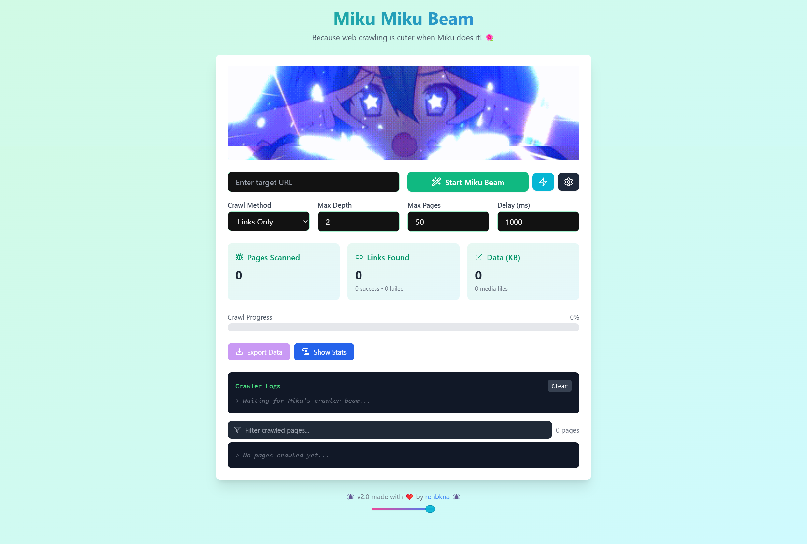
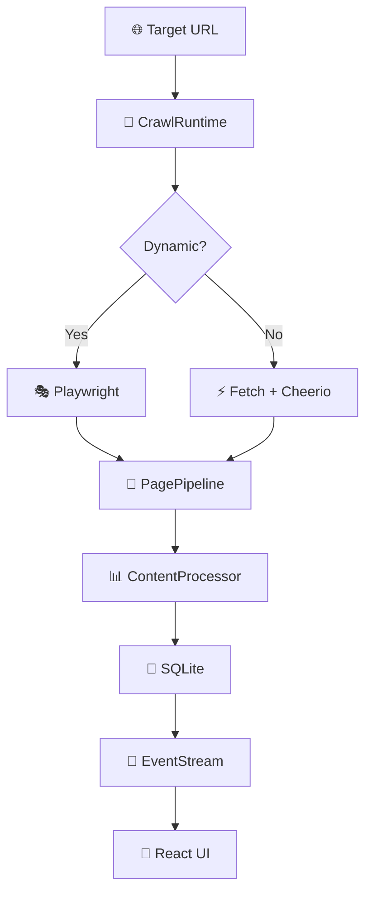

<p align="center">
  
</p>

<h1 align="center">🌸 Miku Miku Crawler 🌸</h1>

<p align="center">
  <b>✨ A Kawaii Web Crawler with Real-Time Visualization ✨</b>
</p>

<p align="center">
  
  
  
  
  
</p>

<p align="center">
  A <b>real-time web crawler</b> with a <b>Miku-themed UI</b> and <b>live visualization</b>.<br/>
  Watch pages get crawled in real-time, analyze content quality, and export structured data<br/>
  — all wrapped in a cute interface.
</p>

<p align="center">
  🔄 <b>Live SSE streaming</b> · 📊 <b>Content analysis</b> · 💾 <b>Persistent storage</b> · 🎨 <b>Miku-themed UI</b>
</p>

<p align="center">
  Inspired by <a href="https://github.com/sammwyy/MikuMikuBeam">MikuMikuBeam</a> by <a href="https://github.com/sammwyy">Sammwy</a> 💕
</p>

<p align="center">
  
</p>

---

## 🌟 Features

<table>
<tr><td>

### 🕷️ Crawling

| | Feature |
|---|---------|
| 📡 | **SSE streaming** — ordered, resumable events with sequence tracking |
| 🎭 | **Playwright** — renders JavaScript-heavy pages with headless Chromium |
| ⚡ | **Cheerio** — fast HTML extraction for static pages |
| 🤖 | **robots.txt** — optional compliance with crawl rules and crawl-delay |
| 🔀 | **Concurrency** — configurable parallel fetch workers |
| 🔄 | **Retry with backoff** — automatic retries on transient failures |
| 💾 | **Session resume** — interrupted crawls persist and resume from where they stopped |
| 🚦 | **Domain throttling** — per-domain rate limiting to be a polite crawler |

</td></tr>
<tr><td>

### 📊 Content Processing

Every crawled page goes through a full analysis pipeline:

| | Analysis |
|---|---------|
| 🔑 | **Keywords** — frequency-based extraction, filters stop words (EN/ES/FR/DE) |
| 🌐 | **Language** — detection via `franc` |
| 💭 | **Sentiment** — custom lexicon-based analyzer |
| 📖 | **Readability** — Flesch-Kincaid scoring |
| ⭐ | **Quality** — title, meta, content length, headings, alt text, links |
| 🏗️ | **Structured data** — JSON-LD, Open Graph, Twitter Cards, microdata |
| 🖼️ | **Media** — images and videos with URLs and alt text |
| 🔗 | **Links** — classified as internal, external, social, or navigation |

</td></tr>
<tr><td>

### 🎨 Interface

| Component | |
|-----------|---|
| `CrawlerForm` | Configure and launch crawls |
| `StatsGrid` | Live counters — pages, data size, speed |
| `ProgressBar` | Visual crawl progress |
| `CrawledPagesSection` | Virtualized page list with search & filter |
| `TheatreOverlay` | Full page preview with processed data |
| `ExportDialog` | JSON / CSV export |
| `ResumeSessionsPanel` | Browse & resume interrupted sessions |
| `LogsSection` | Live crawl log stream |
| `MikuBanner` | ✨ Animated mascot ✨ |

</td></tr>
</table>

---

## 🚀 Quick Start

> **Requires [Bun](https://bun.sh)** — the fast JavaScript runtime.

```bash
git clone https://github.com/renbkna/mikumikucrawler
cd mikumikucrawler
bun install
bun run dev
```

| | Service | URL |
|---|---------|-----|
| 🎨 | Frontend | <http://localhost:5173> |
| ⚙️ | Backend | <http://localhost:3000> |
| 📋 | OpenAPI | <http://localhost:3000/openapi> |

<details>
<summary>🔧 <b>Environment Variables</b></summary>

<br/>

Copy `.env.example` → `.env`. All variables have sensible defaults. Frontend vars need the `VITE_` prefix.

```env
PORT=3000
NODE_ENV=development
FRONTEND_URL=http://localhost:5173
VITE_BACKEND_URL=http://localhost:3000
DB_PATH=./data/crawler.db
LOG_LEVEL=info
USER_AGENT=MikuCrawler/3.0.0
RENDER=false
```

</details>

<details>
<summary>⚙️ <b>Crawler Options</b></summary>

<br/>

| Setting | Default | Range |
|---------|---------|-------|
| Crawl Depth | `2` | 1–5 |
| Max Pages | `50` | 1–200 |
| Max Pages Per Domain | `50` | 1–200 |
| Crawl Delay | `1000ms` | 200–10000ms |
| Method | `links` | links / content / media / full |
| Concurrent Requests | `5` | 1–10 |
| Retry Limit | `3` | 0–5 |
| Dynamic Content | `true` | — |
| Respect Robots | `true` | — |
| Content Only | `false` | — |
| Save Media | `false` | — |

</details>

---

## 🔌 API

> Full OpenAPI spec at [`/openapi`](http://localhost:3000/openapi)

| | Method | Endpoint | Description |
|---|--------|----------|-------------|
| 🆕 | `POST` | `/api/crawls` | Create a crawl run |
| 📋 | `GET` | `/api/crawls` | List crawl runs |
| 🔍 | `GET` | `/api/crawls/:id` | Get crawl state & counters |
| ⏹️ | `POST` | `/api/crawls/:id/stop` | Request graceful stop |
| ▶️ | `POST` | `/api/crawls/:id/resume` | Resume an interrupted crawl |
| 📡 | `GET` | `/api/crawls/:id/events` | SSE event stream |
| 📦 | `GET` | `/api/crawls/:id/export` | Export pages (JSON / CSV) |
| 🗑️ | `DELETE` | `/api/crawls/:id` | Delete a stored crawl |
| 📄 | `GET` | `/api/pages/:id/content` | Fetch stored page content |
| 🔎 | `GET` | `/api/search?q=keyword` | Full-text search (FTS5) |
| 💚 | `GET` | `/health` | Health check |

### 📡 Event Stream

```javascript
const source = new EventSource(
  "http://localhost:3000/api/crawls/<crawl-id>/events"
);

source.addEventListener("crawl.progress", (event) => {
  const { sequence, payload } = JSON.parse(event.data);
  console.log(payload.counters);
});
```

| Event | When |
|-------|------|
| `crawl.started` | Crawl begins processing |
| `crawl.progress` | Counter & queue stats update |
| `crawl.page` | A page was crawled |
| `crawl.log` | Runtime log message |
| `crawl.completed` | Crawl finished normally |
| `crawl.stopped` | Stopped by user |
| `crawl.failed` | Terminated due to error |

Events are sequenced — use `Last-Event-ID` for resumable connections.

---

## 🏗️ Tech Stack

<table>
<tr>
<td width="50%">

### 🎨 Frontend

| | Technology |
|---|------------|
| ⚛️ | React 19 |
| 📘 | TypeScript |
| 🎨 | Tailwind CSS 4 |
| ⚡ | Vite |
| 🔗 | Eden Treaty |
| ✏️ | Lucide React |

</td>
<td width="50%">

### ⚙️ Backend

| | Technology |
|---|------------|
| 🥟 | Bun + bun:sqlite |
| 🦊 | Elysia + OpenAPI |
| 🎭 | Playwright |
| 📝 | Pino |
| 📊 | OpenTelemetry |
| 🔒 | IP validation + rate limiting |

</td>
</tr>
</table>

<details>
<summary>📁 <b>Project Structure</b></summary>

<br/>

```
server/
├── api/                    # Elysia route handlers
├── contracts/              # OpenAPI schemas + shared type re-exports
├── domain/crawl/           # Core crawl logic
│   ├── CrawlQueue.ts      #   Priority queue with domain throttling
│   ├── CrawlState.ts      #   Counters, visited URLs, stop logic
│   ├── DynamicRenderer.ts  #   Playwright lifecycle
│   ├── FetchService.ts     #   HTTP fetching with security checks
│   ├── PagePipeline.ts     #   Fetch → process → store pipeline
│   ├── RobotsService.ts    #   robots.txt evaluation
│   └── UrlPolicy.ts        #   URL filtering and normalization
├── runtime/                # Crawl execution layer
│   ├── CrawlRuntime.ts     #   Orchestrates a single crawl run
│   ├── CrawlManager.ts     #   Creates, stops, resumes, lists runs
│   ├── EventStream.ts      #   Sequenced SSE publishing
│   └── RuntimeRegistry.ts  #   Active runtime tracking
├── processors/             # Content analysis
│   ├── ContentProcessor.ts #   Dispatch by content type
│   ├── analysisUtils.ts    #   Keywords, quality scoring
│   ├── extractionUtils.ts  #   Metadata, structured data, links
│   └── sentimentAnalyzer.ts
├── storage/                # SQLite persistence
│   ├── migrations/         #   Schema migrations
│   └── repos/              #   Query repositories
├── plugins/                # Elysia plugins (DI, security, logging)
└── config/                 # Env validation, logging setup

shared/                     # Cross-boundary contracts
├── contracts/              #   Domain types (status, events, pages)
├── types.ts                #   Shared domain types
└── url.ts                  #   URL validation & normalization
```

</details>

---

## 🔮 How It Works


```mermaid
graph TD
    A[🌐 Target URL] --> B[🎵 CrawlRuntime]
    B --> C{Dynamic?}
    C -->|Yes| D[🎭 Playwright]
    C -->|No| E[⚡ Fetch + Cheerio]
    D --> F[📄 PagePipeline]
    E --> F
    F --> G[📊 ContentProcessor]
    G --> H[💾 SQLite]
    H --> I[📡 EventStream]
    I --> J[🎨 React UI]
```

1. **Client** creates a crawl via `POST /api/crawls`
2. **CrawlManager** spawns a **CrawlRuntime** with its own queue and state
3. Pages are fetched via **FetchService** (static) or **Playwright** (dynamic)
4. **PagePipeline** processes content, extracts links, and stores results
5. **EventStream** publishes sequenced SSE events to the frontend ✨

---

## 🚢 Deployment

```bash
bun run build && bun start
```

<details>
<summary>🐳 <b>Docker</b></summary>

<br/>

```bash
docker build -t mikumikucrawler .
docker run -p 3000:3000 mikumikucrawler
```

</details>

```env
NODE_ENV=production
PORT=3000
FRONTEND_URL=https://your-domain.com
DB_PATH=/data/crawler.db
```

---

## ✅ Verification

```bash
bun run check
```

Format → Lint → Type-aware lint → Typecheck → Tests → Build

---

## ⚠️ Responsible Use

| | |
|---|---|
| ✅ | Get permission before crawling |
| ✅ | Respect robots.txt and rate limits |
| ✅ | Use reasonable delays |
| ❌ | Don't overload servers |
| ❌ | Don't scrape copyrighted content without authorization |

---

## 🤝 Contributing

1. Fork the repo
2. Create a feature branch: `git checkout -b my-feature`
3. Commit changes: `git commit -m 'Add feature'`
4. Push: `git push origin my-feature`
5. Open a Pull Request

---

<div align="center">

### 👨‍💻 Developer

**[renbkna](https://github.com/renbkna)** — Solo Developer & Miku Enthusiast

### 🙏 Special Thanks

**[Sammwy](https://github.com/sammwyy)** — Original MikuMikuBeam inspiration

---

📜 MIT — see [LICENSE](LICENSE)

---


### 🌸 Miku Miku Crawler 🌸

**Made with 💖 by a developer who thinks crawlers can be cute**

<br/>

[](https://github.com/renbkna/mikumikucrawler/stargazers)
[](https://github.com/renbkna/mikumikucrawler/network/members)
[](https://github.com/renbkna/mikumikucrawler/issues)

</div>
