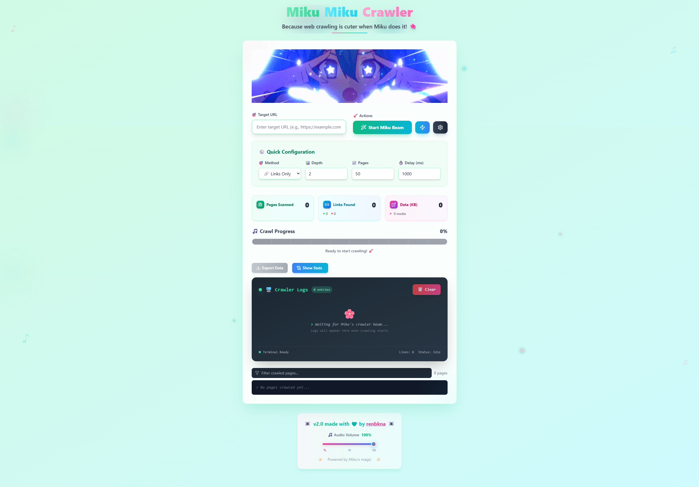

# 🌸 Miku Miku Crawler 🌸

<div align="center">
  

  <h3>✨ A Kawaii Web Crawler with Real-Time Visualization ✨</h3>

  
  
  
  
</div>

---

## 🎭 What is Miku Miku Crawler?

A **real-time web crawler** with a **Miku-themed UI** and **live visualization**. Watch pages get crawled in real-time, analyze content quality, and export structured data — all wrapped in a cute interface.

- 🔄 **Real-time updates** via native WebSockets
- 📊 **Content analysis** with quality scoring, keyword extraction, and sentiment detection
- 💾 **SQLite storage** for persistent crawl data
- 🎨 **Miku-themed UI** with animations

Inspired by [MikuMikuBeam](https://github.com/sammwyy/MikuMikuBeam) by [Sammwy](https://github.com/sammwyy).



---

## ✨ Features

### 🕷️ **Crawling**

| Feature | Description |
|---------|-------------|
| **WebSocket streaming** | Live page updates as they're crawled via native WebSockets |
| **Puppeteer support** | Renders JavaScript-heavy pages when enabled |
| **Cheerio parsing** | Fast HTML extraction for static pages |
| **robots.txt** | Optional compliance with crawl rules |
| **Concurrent requests** | Configurable parallelism (default: 5) |
| **Retry with backoff** | Automatic retries on failed requests |

### 📊 **Content Processing**

What actually happens to each page:

| Analysis | How it works |
|----------|--------------|
| **Keyword extraction** | Frequency-based, filters stop words (EN/ES/FR/DE) |
| **Language detection** | Uses `languagedetect` library |
| **Sentiment analysis** | Lexicon-based analysis using `sentiment` library |
| **Readability score** | Flesch-Kincaid approximation |
| **Quality scoring** | Checks: title, meta description, content length, headings, images w/ alt, links |
| **Structured data** | Extracts JSON-LD, Open Graph, Twitter Cards, microdata |
| **Media extraction** | Lists images/videos with URLs and alt text |
| **Link classification** | Internal, external, social, navigation |

### 🎨 **UI Components**

| Component | What it does |
|-----------|--------------|
| `StatsGrid` | Live counters for pages, data size, speed |
| `ProgressBar` | Visual crawl progress |
| `CrawledPagesSection` | Paginated list with search/filter |
| `TheatreOverlay` | Full page preview with processed data |
| `ExportDialog` | JSON/CSV export |
| `MikuBanner` | Animated mascot |
| `ToastNotification` | Pop-up feedback |

---

## 🚀 Quick Start

This project is built for **Bun**. Ensure you have [Bun](https://bun.sh) installed.

```bash
# Clone
git clone https://github.com/renbkna/mikumikucrawler
cd mikumikucrawler

# Install
bun install

# Run (starts both frontend + backend)
bun run dev
```

Open `http://localhost:5173` in your browser.

### 🔧 Environment Variables

The project follows a "Fail-fast" environment strategy with sensible defaults. Copy `.env.example` to `.env`:

> **Note:** Frontend variables must be prefixed with `VITE_` to be loaded by the browser.

```env
# Server
PORT=3000
NODE_ENV=development # 'production' enables JSON logging

# Frontend (must have VITE_ prefix)
VITE_BACKEND_URL=http://localhost:3000
VITE_WS_URL=ws://localhost:3000/ws

# Backend
FRONTEND_URL=http://localhost:5173
DB_PATH=./data/crawler.db
LOG_LEVEL=info
RENDER=false # Set to true for low-memory environments
```

---

## ⚙️ Crawler Options

### Basic Settings

| Setting | Default | Range |
|---------|---------|-------|
| **Crawl Depth** | `2` | 1-5 |
| **Max Pages** | `50` | 1-200 |
| **Crawl Delay** | `1000ms` | 200-10000ms |
| **Method** | `links` | links/content/media/full |

### Advanced Settings

| Setting | Default | Notes |
|---------|---------|-------|
| **Concurrent Requests** | `5` | More = faster but harder on target server |
| **Retry Limit** | `3` | Maximum number of retries |
| **Dynamic Content** | `true` | Uses Puppeteer (slower but handles JS) |
| **Respect Robots** | `true` | Follows robots.txt |
| **Content Only** | `false` | Skip full HTML storage |
| **Process Media** | `false` | Extract image/video metadata |

---

## 🔌 API

### Health Check

```http
GET /health
```

```json
{
  "status": "ok",
  "activeCrawls": 0,
  "uptime": 123.456,
  "memoryUsage": {
    "rss": 123456789,
    "heapTotal": 50000000,
    "heapUsed": 30000000,
    "external": 1000000
  }
}
```

### Statistics

```http
GET /api/stats
```

Returns system-wide aggregate statistics, language distribution, and content quality metrics.

```json
{
  "status": "ok",
  "stats": {
    "totalPages": 150,
    "totalDataSize": 5242880,
    "uniqueDomains": 12,
    "lastCrawled": "2025-12-31T12:00:00.000Z",
    "activeCrawls": 1,
    "content": {
      "avgWordCount": 450,
      "avgQualityScore": 75,
      "avgReadingTime": 3,
      "totalMedia": 85,
      "totalInternalLinks": 1200,
      "totalExternalLinks": 340
    },
    "languages": [
      { "language": "en", "count": 120 },
      { "language": "es", "count": 15 }
    ],
    "qualityDistribution": [
      { "quality_range": "High (80-100)", "count": 45 },
      { "quality_range": "Medium (60-79)", "count": 80 }
    ]
  }
}
```

### WebSocket Events

```javascript
// Connect and send messages
const ws = new WebSocket('ws://localhost:3000/ws');

// Start crawl
ws.send(JSON.stringify({ type: 'startAttack', data: { target, ...options } }));

// Receive updates
ws.onmessage = (event) => {
  const { type, data } = JSON.parse(event.data);
  // type: 'stats', 'pageContent', 'attackEnd', etc.
};

// Export
ws.send(JSON.stringify({ type: 'exportData', data: 'json' }));
```

---

### 🏗️ Tech Stack

#### Architecture Highlights

- **Centralized Configuration**: All environment variables are validated at startup in `server/config/env.ts`. If a critical variable is missing, the server will fail fast with a descriptive error.
- **Environment-Aware**: Automatically switches between JSON logging (production) and pretty-printing (development) based on `NODE_ENV`.

### Frontend

- **React 19**
- **TypeScript**
- **Tailwind CSS 4**
- **Vite**
- **Native WebSockets** (real-time updates)
- **Lucide React** (icons)
- **Biome** (Linting & Formatting)

### Backend

- **Bun** (Runtime & Native SQLite driver)
- **Elysia** (High-performance web framework)
- **Puppeteer** (Headless browser automation)
- **Pino** (High-performance logging)
- **Robots Parser** (Politeness)

### Crawler Architecture

```
server/crawler/
├── CrawlSession.ts      # Main session orchestrator
├── dynamicRenderer.ts   # Puppeteer lifecycle management
└── modules/
    ├── crawlState.ts    # Queue metrics, page limits, stats
    ├── crawlQueue.ts    # Concurrency, retries, progress events
    ├── pagePipeline.ts  # Content fetching, processing, storage
    └── linkExtractor.ts # Link resolution and deduplication
```

### Content Processing

```
server/processors/
├── ContentProcessor.ts  # Main processor class
├── analysisUtils.ts     # Keywords, sentiment, quality scoring
└── extractionUtils.ts   # Metadata, structured data, media, links
```

---

## 🔮 How It Works


1. **Client** sends crawl request via WebSocket.
2. **Server** validates and enqueues the URL.
3. Pages fetched via **Fetch** (static) or **Puppeteer** (dynamic).
4. **ContentProcessor** extracts metadata and analyzes sentiment.
5. Results saved to **SQLite** and streamed to the UI.

---

## 🚢 Deployment

```bash
# Build frontend
bun run build

# Start production server
bun start
```

### Environment for Production

```env
NODE_ENV=production
PORT=3000
FRONTEND_URL=https://your-domain.com
DB_PATH=/path/to/data/crawler.db
```

See [DOCKER_DEPLOY.md](./DOCKER_DEPLOY.md) for Docker instructions.

---

## ⚠️ Responsible Use

- ✅ Get permission before crawling.
- ✅ Respect robots.txt and rate limits.
- ✅ Use reasonable delays.
- ❌ Don't overload servers.
- ❌ Don't scrape copyrighted content without authorization.

---

## 🤝 Contributing

1. Fork the repo.
2. Create a feature branch: `git checkout -b my-feature`.
3. Commit changes: `git commit -m 'Add feature'`.
4. Push: `git push origin my-feature`.
5. Open a Pull Request.

---

## 👨‍💻 Developer

<div align="center">

**[renbkna](https://github.com/renbkna)** — Solo Developer & Miku Enthusiast

### 🙏 Special Thanks

**[Sammwy](https://github.com/sammwyy)** — Original MikuMikuBeam inspiration

</div>

---

## 📜 License

MIT — see [LICENSE](LICENSE)

---

<div align="center">


### 🌸 Miku Miku Crawler 🌸

**Made with 💖 by a developer who thinks crawlers can be cute**

---

[](https://github.com/renbkna/mikumikucrawler/stargazers)
[](https://github.com/renbkna/mikumikucrawler/network/members)
[](https://github.com/renbkna/mikumikucrawler/issues)

</div>
